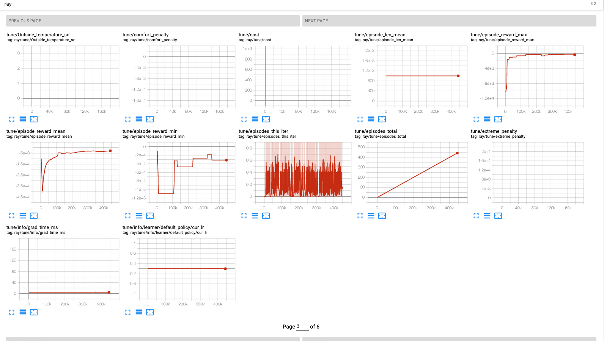

# Inspiration

As part of the AI for [Climate Change hackathon](https://github.com/ai-launchlab/ccai-hackathon-2019), we wanted to develop an application of reinforcement learning that could help households in Montreal reduce their carbon footprint. This wasn't obvious, since so much of our household energy is low-carbon electricity from hydropower. However, residential heating still predominantly relies on fossil fuels while accounting for the lion's share of Canadians' energy consumption: making it an ideal problem to tackle for this hackathon. In fact, natural gas for residential space heating in Canada produced ~24,000,000 tC02 in 2016. To address this, we built a simple 2D heat transfer model to simulate houses in Montreal's winter, and trained a reinforcement learning agent to optimize heating schedules so as to reduce waste and maximize the comfort of simulated occupants with their own schedule and temperature preferences.

#### [Residential Energy Use in Canada](https://www.nrcan.gc.ca/energy-and-greenhouse-gas-emissions-ghgs/20063#L1)

 

# Environments
We created an openai gym environment for our simulations, which models a procedurally generated house as a 2D grid world along with it's heat transfer dynamics and the behavior of its occupants. The environments are inherited from [gym-minigrid](https://github.com/maximecb/gym-minigrid) library to facilitate visualizations.

## State Space
### House
Each cell represents a room in a 2-D grid. The cell can be occupied by one of the following objects:www
- `Homie` a person in the house
- `Wall` a type of isolation that captures the heat 
- `HeatingTile` a cell in the grid that can be targeted by the 
- `Outdoors` a cell of the grid that can not be directly controlled by the system and assumes an outside temperature.

### MultiRoomHouse
In contrast to the `House` environment, here a room may consist of multiple `HeatingTile`s surrounded by `Wall`s and connected via `Door`s with neighbouring rooms. This is a more realistic example, since we can assign various densities to the object, allowing for a more sophisticated heat transfer models.
Moreover, this allows to place multiple `Homie`s in the same room (with possibly different temperature preferences), adding even more interesting scenarios. 

## Action Space
In both types of environments, the actions space is represented by binary matrices shaped like the underlying grid, with active elements corresponding to the `HeatingTile`s that should be activated. To avoid controlling each tile individually actions are applied on each `Room` of the House. This is a simplification, but one could extend the heat transfer model to each individual room to achieve more realistic simulation.

## Rewards
Two main sources of the reward are the discomfort_penalty and the cost of heating.
The costs for the heating are fixed at 1 unit of currency per timestamp per cell. It should be straightforward to extend the calculation to take volume of an individual cell into account. 
Discomfort of the `Homie` is calculated based on the squared deviation from the acceptable temperature range.
In the future work, reward function will have to be revisited and the discomfort would have to be more precisely quantified via some utility function.

# Learning Algorithms

The library utilizes [RLlib](https://ray.readthedocs.io/en/latest/rllib.html) implementation of DQN with prioritized experience replay.
State is efficiently represented as a nxnx2 grid, where the first 2 dimensions correspond to the grid size and the last dimension encodes object type and temperature.
DQN was tested on a 4x4 `House` with starting temperature of 15 degrees and ambient temperature of 5. Maximizing the comfort of `Homie`s and minimizing costs for heating was successfully achieved with untuned DQN that ran for ~500 million examples.

# Heat Transfer Modeling
We originally tried to model emissivity/conduction/convection individually, however we ended up using [RSI-values](https://en.wikipedia.org/wiki/R-value_(insulation)) to approximate the heat flow in and out of rooms while making some simplifying assumptions:  
- The air in each room is perfectly mixed, leading to uniform temperatures;
- Walls have an RSI value of 4.2, in line with government recommendations for houses in Montreal;
- Outside temperatures act as a heat sink and do not change due to heat flow;
- Variables such as the heat capacity of air and the RSI value of the walls do not change with temperature;
- The instantaneous temperature differential across a wall is used to estimate the heat flow for the next 60s;

# Real-World Applications

## Existing heating systems
Heaters with knobs / buttons / sensors that could be manipulated.

## Newly-installed heating systems
Due to widespread connectivity, we expect modern heating systems to have internet connection.

## Cost savings analysis
